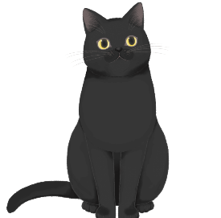
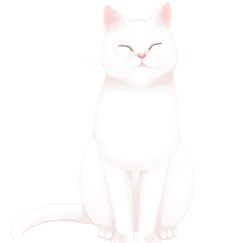

# live2d widget

## What is this?

This is my own deployment of [live2d-widget](https://github.com/stevenjoezhang/live2d-widget). Here are the main differences:

- Deployed character models: hijiki (black cat), tororo (white cat), and wanko (puppy).
- Dialogue is translated to English from Chinese.
- More appropriate dialogue.
- Only switch and exit buttons.

## Models

Here are the three models I've used:

### Hijiki (Black Cat)


### Tororo (White Cat)


### Wanko (Puppy)


## Usage

Append the CDN link ```<script src="https://cdn.jsdelivr.net/gh/brandonkylely/l2d-widget@master/autoload.js"></script>``` to the end of your index.html file if you would like to use my version. Otherwise, see below.

## Customization

[live2d-widget](https://github.com/stevenjoezhang/live2d-widget) has documentation on this in both English and Chinese. However, in the interest of time, here is a summary of how to customize this widget for your own sites.


```
live2d-widget/
├── src/
│   └── index.js
├── autoload.js  # edit live2d_path to your own widget CDN, edit cdnPath to another model host or your own, edit tools to add or remove features.
└── waifu-tips.json  # edit majority of dialogue
```

The following repositories are for model switching. You need to deploy your live2d_api as a CDN link and then reference it in autoload.js in live2d_widget. Use live2d-widget-models to find new models if you don't want to make your own.

- https://github.com/fghrsh/live2d_api

- https://github.com/xiazeyu/live2d-widget-models  

```
live2d-api/
├── model/
│   └── *groupname*/
│       └── *live2d-widget-model-name*/
└── model-list.json  # Add and remove models, change intro message for each model.
```
```
live2d-widget-models/
├── packages/
│   └── *live2d-widget-model-name*/ # copy this and move it to your api
```

For the CDN links, the simplest solution is to deploy to github and find your repository on jsdelivr.

